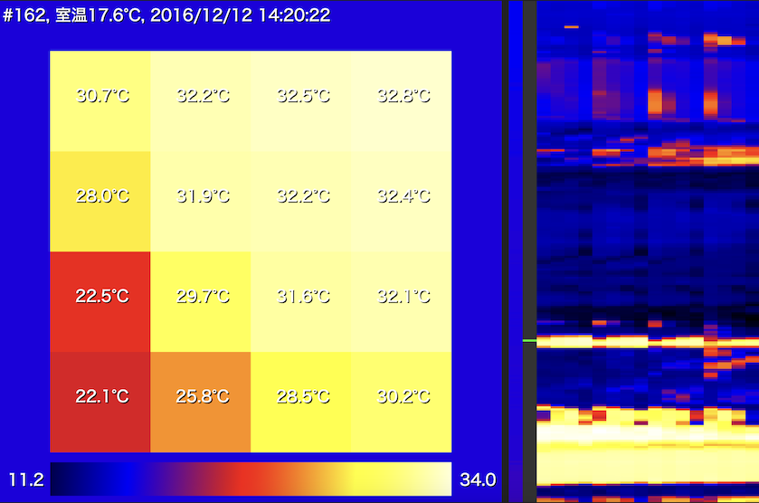

# D6T Viewer
A tool to view termal distribution captured by [the Omron D6T Sensor](https://www.omron.co.jp/ecb/product-detail?partNumber=D6T). 



## Thermal distribution csv file format
**csv format**

Row name | Description | Type
--- | --- | ---
No | Data number | integer
Date | Recorded date | string (YYYY-MM-DD-H-m-ss-msec)
Room | Ambient temperature[Celcius] | float
P[X] | Cell temperature[Celcius], X=0~15 for 4x4 sensor | float

**Example**

```csv
No,Date,Room,P[0],P[1],P[2],P[3],P[4],P[5],P[6],P[7],P[8],P[9],P[10],P[11],P[12],P[13],P[14],P[15],
0,2016-12-11-17-4-31-208,1.6200001,14.9,14.7,13.3,13.1,14.9,15.0,14.8,13.5,15.1,14.8,15.1,14.8,15.0,14.9,15.0,14.7,
1,2016-12-11-17-4-31-466,1.6299999,14.8,14.5,12.9,13.2,14.9,15.0,14.6,12.9,15.0,14.8,15.0,14.6,15.1,14.9,14.9,14.5,
```

## Building the development environment
```bash
npm install
```

## Build for development
A browser will be launched on the local host to test the behavior. When you update the code, the browser will hot reload.

```bash
npm run start
```

## Build for production
```bash
npm run build
```
